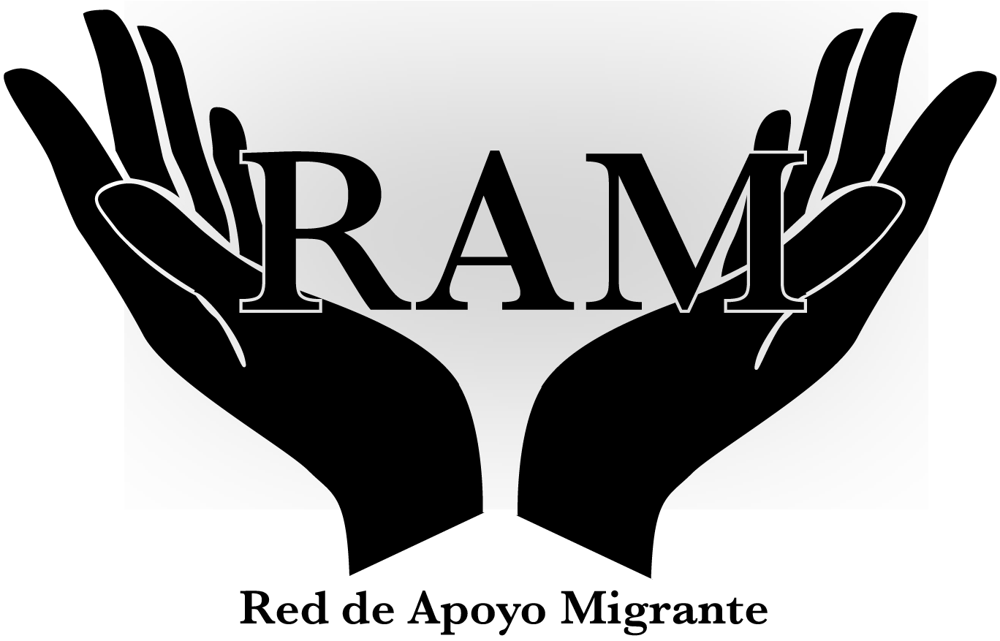

##RED DE APOYO MIGRANTE - RAM

                                  
## Introduccion

 La migración es un decisión de vida que afecta tanto al individuo como a su entorno, sin embargo a veces se olvida un poco lo difícil que es cambiar todo a tu alrededor por lo tanto a través de este proyecto se busca que migrantes de cualquier nación radicados en Chile compartan datos de interés que permitan a otros migrantes conocer mejores oportunidades de vivienda, empleo educación o simplemente les permitan conocer la forma correcta de realizar tramites, y así no repetir errores que otros ya cometieron.
 
## Resumen del proyecto

Este proyecto cuenta con 3 historias de usuarios, migrantes quienes manifiestan la necesidad de compartir información relevante para la vida cotidiana en chile en pro de mejorar la calidad de vida, afrontando con mas herramientas temas como búsqueda de trabajo, vivienda o tramites migratorios. 

### Definición del producto

RAM es una plataforma digital cuyo objetivo es que cualquier persona pueda registrarse e ingresar a una "RED SOCIAL" cuyo objetivo básico es compartir información de interés para el migrante por lo cual al momento de realizar cualquier publicación el usuario debe seleccionar de que tratara su publicación, donde puede elegir entre los siguientes ítems:

* Eduación
* Trabajo
* Vivienda
* Tramites/Documentación
* Compra/Venta
* Otros

### Historias de usuario

#### Usuario 1

Karina Rojas es colombiana y como nueva usuaria de RAM desea poder registrarse en la red para acceder a la información que la misma le ofrece, quiere ingresar con su correo de gmail o con sus datos personales

- **Criterios de Aceptación:** 
>El usuario debe poder crear una cuenta 
>El usuario debería poder loguearse con la contraseña o correo correcto, en caso de error que envié un mensaje   de credenciales incorrectas
>Debe poder loguearse a través de gmail.

#### Usuario 2

Karen Quezada es peruana y como nueva usuaria de RAM desea poder acceder a información de interés para ella, como compra venta de productos peruanos como golosinas o víveres. También considera que pueden informar a otros migrantes sobre su trabajo part time, donde no es requisito fundamental tener visa definitiva.

- **Criterios de Aceptación:** 
>El usuario debe poder hacer ingresar a " Busqueda " donde puede seleccionar sobre los ítems de interes mencionados en la definicion del producto.
>El usuario debe poder hacer comentarios en post de interés, editarlos, borrarlos, dar me gusta y poder llevar   un conteo de estos

#### Usuario 3
Angel Talabera es venezolano y tuvo muchos inconvenientes para encontrar vivienda por lo que considera que RAM seria de mucha utilidad si puede ingresar y contactar a otros usuarios que den información de vivienda o trabajo. 

- **Criterios de Aceptación:** 
>Si el usuario al loguerse correctamente puede seleccionar sus temas de interés y al ingresar al perfil de quien publica puede encontrar sus datos de contacto. 

## Herramientas 🛠️
* Javascript
* CSS
* HTML
* Firebase
* Git Hub

### Diseño de la Interfaz de Usuario (prototipo de baja fidelidad)

## Autor ✒️
Laura Natalia Ramirez Rojas - Master

